# Vue3 Pipecloud 预制排产系统

Vue3 Pipecloud 是一款面向管道预制业务的项目化管理平台，采用 Vue 3 + Django 前后端分离架构。系统以项目为业务与数据边界，覆盖管道预制从设计数据准备、材料到货与占用、防腐/下料/焊接排产，到计划执行、完成情况同步和滚动维护的相对完整流程。

前端提供项目总控、文件解析与导入、管段校核、预制排产工作台、计划维护、库管理、批量文件导出、三维工厂和系统设置等交互页面；后端提供项目数据管理、文件解析、结构化数据入库、材料库维护、预排产匹配、排产文件生成、计划数据同步及定时任务等核心能力。

## 技术架构

- 前端：Vue 3、Vite、Vuetify、Vue Router、VisActor VTable、Three.js。
- 后端：Django、MySQL、pandas/openpyxl、APScheduler。

## 功能模块

### 1. 项目首页

项目首页是项目级总控台，集成项目切换、项目数据、约束配置和业务看板。
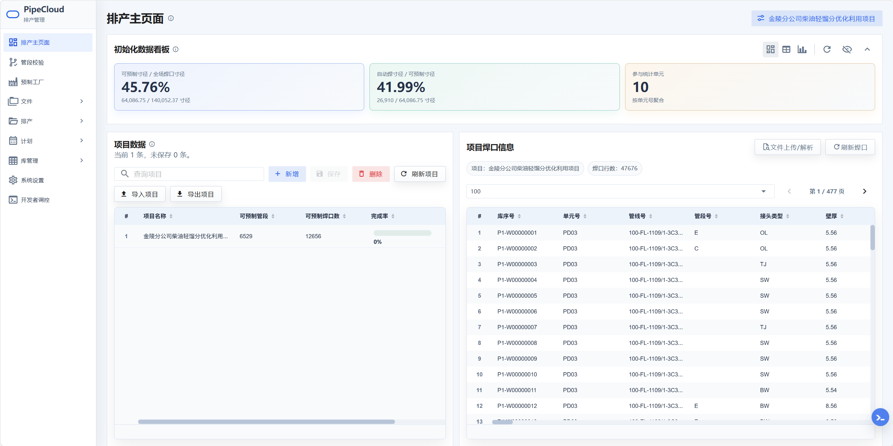

- 项目管理：支持新增、编辑、删除、导入、导出和切换当前项目。
- 项目约束：维护防腐与焊接工序先后顺序等项目级约束，排产工作台据此调整流程顺序。
- 业务看板：展示初始化、到货、防腐、下料和焊接等统计；看板为可复用组件，支持折叠和按设置控制可见性。
- 个性化入口：系统设置可控制首页组件、导航项和部分模块的显示状态，以适配不同岗位。

### 2. 文件解析、初始化导入与批量导出

文件模块负责把设计文件或已有初始化数据安全地接入当前项目。
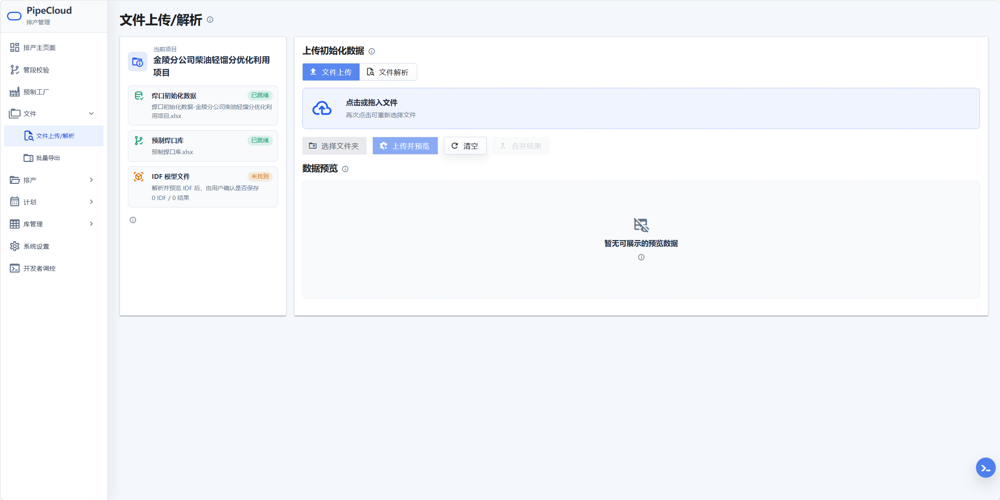
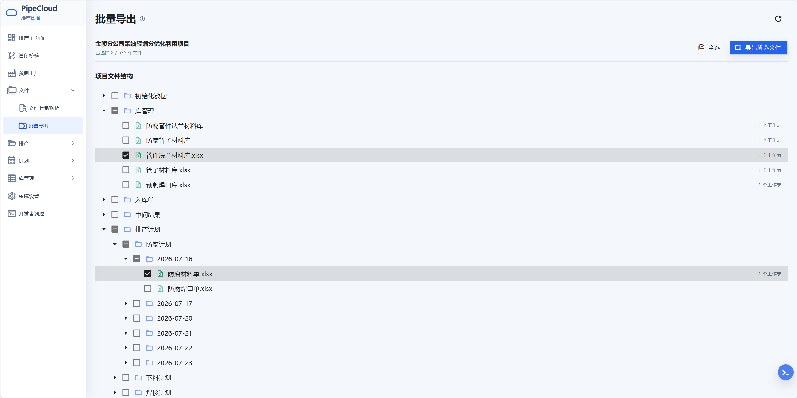

- IDF/PCF 解析：支持批量上传同一格式的 IDF 或 PCF 文件，生成焊口初始化结果；IDF 结果还可保存项目空间模型。
- 初始化文件上传：支持上传 `.xlsx`、`.xlsm` 初始化焊口数据并执行列名归一化、必填字段检查和数据预览。
- 预览与合并：多文件结果可分别切换预览；适用结果可合并后统一核对。
- 历史结果恢复：可恢复当前项目最近一次解析结果，恢复成功、无历史结果和恢复失败均通过全局消息中心反馈。
- 确认导入：预览确认后可按新增或覆盖方式写入项目初始化数据；未确认结果离开页面时会提示确认。
- 结果下载：支持下载当前解析结果或批量下载可用结果。
- 批量文件导出：按项目文件树勾选数据、计划和库文件，后台打包为 ZIP 下载，便于归档和流转。

### 3. 管段校核

管段校核用于集中检查当前项目的单元、管段、焊口和材料组成，默认以预制焊口库为数据源。
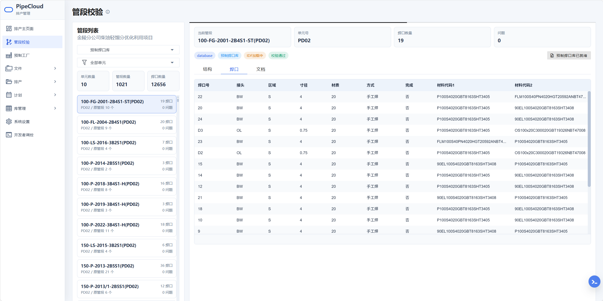

- 按单元筛选管段并查看管段清单。
- 展示选中管段的结构、材料和焊口明细。
- 统计管段、材料、焊口数量及长度等指标。
- 提供结构视图和三维查看能力，辅助人工核查组成关系与材料匹配。

### 4. 预制排产工作台

预制排产工作台是核心业务承载区，包含初始化预制、到货管理、材料匹配与锁定、防腐排产、下料排产、焊接排产和总排产计划七类流程。各模块以项目数据库为主数据源，并展示依赖状态、统计看板、预排产结果、暂存文件和确认保存操作。

#### 初始化预制
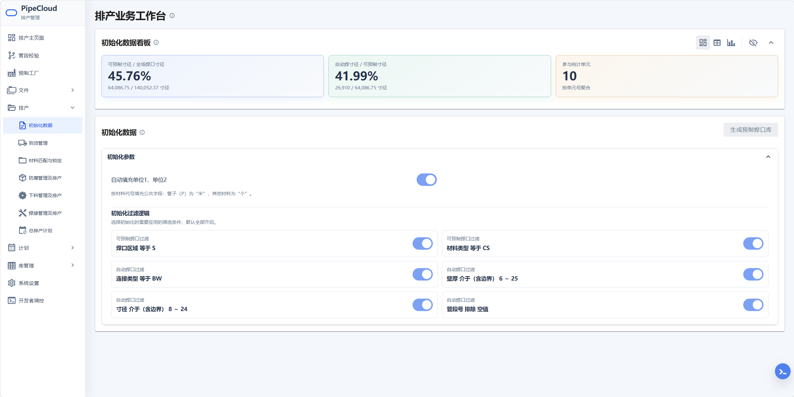

- 从项目初始化焊口数据中筛选可预制焊口。
- 执行自动焊划分、连接链路识别和预制焊口库生成。
- 统计总焊口、可预制焊口、自动焊焊口、单元分布及占比等指标。
- 支持长任务进度展示和取消。

#### 到货管理
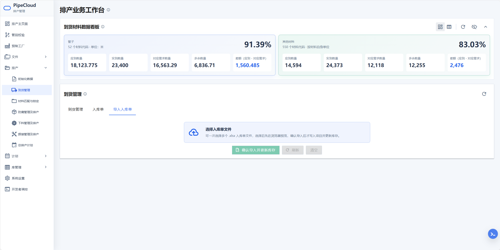

- 批量上传并预览 Excel 入库单，确认后写入项目到货数据。
- 查看入库单、工作表、明细及到货日期汇总。
- 生成或维护管子材料库、管件法兰材料库和相关防腐材料数据。
- 将材料到货状态同步回预制焊口库，作为后续材料匹配与排产条件。

#### 材料匹配与锁定
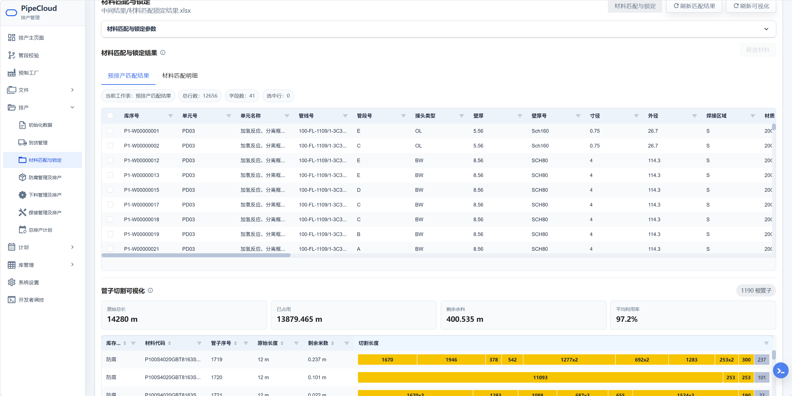

- 基于预制焊口库与项目材料库执行材料匹配。
- 支持自动范围或手动选择焊口，可配置集中度维度、阈值及是否仅自动焊参与。
- 更新材料占用状态，并展示管子切割占用、余量和利用率。
- 支持选中并释放已锁定材料，以便重新调整匹配方案。

#### 防腐管理及排产
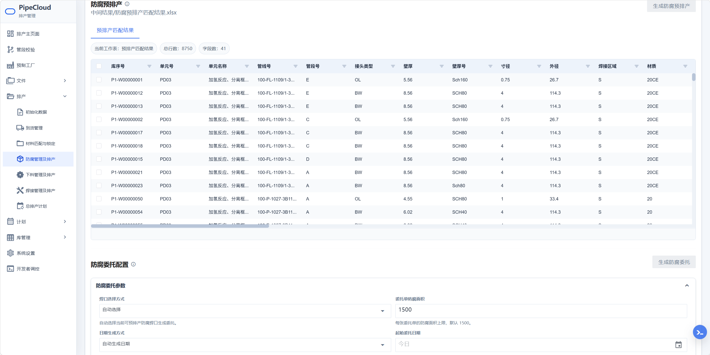

- 根据焊口与材料状态生成防腐预排产匹配结果，区分可排产与不可排产记录。
- 支持自动或手动选择预排产范围。
- 可配置委托面积、日期模式、开始日期、最大天数、节假日跳过和手动日期。
- 防腐委托先暂存并提供文件/表格预览，确认后写入防腐计划数据。

#### 下料管理及排产
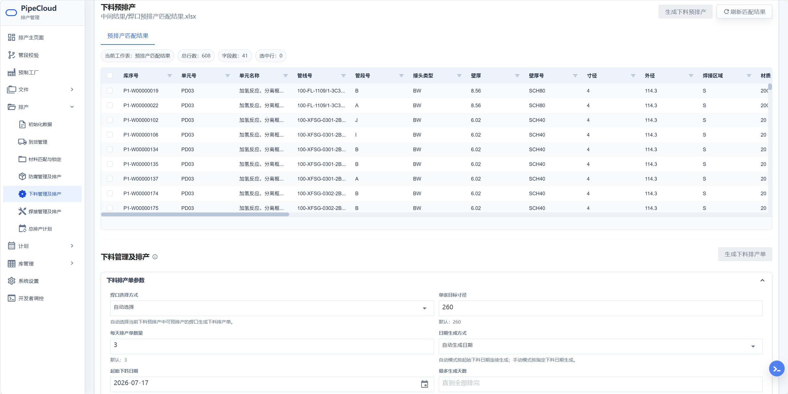

- 综合材料匹配、到货和防腐条件生成下料预排产结果及不可排原因。
- 展示管材切割分配、余料和材料利用率等可视化信息。
- 支持自动或手动选择记录，并配置目标寸径、每日排产单数、日期模式、开始日期、节假日和手动日期。
- 计划先进入暂存预览，确认后保存下料排产单和关联计划数据。

#### 焊接管理及排产
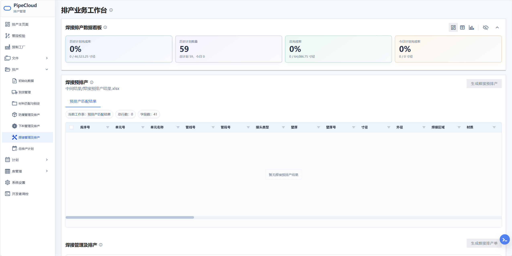

- 在初始化、材料匹配和下料等前置条件满足后生成焊接预排产结果。
- 配置首个焊接日期、最大天数、目标寸径、每日排产单数、日期模式、节假日和手动日期。
- 生成焊接排产单、管段焊口表、材料明细及领料相关数据。
- 暂存结果确认后写入计划；完成状态可同步回预制焊口库并更新项目指标。

#### 总排产计划
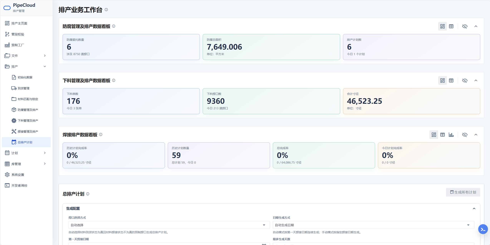

- 面向未来滚动生成防腐、下料、焊接及总排产计划。
- 支持自动范围或手动焊口范围。
- 配置焊接开始日期、最大排产天数、每日单数、目标寸径、日期模式、节假日、下料/防腐提前量和防腐委托面积等参数。
- 支持文件级暂存预览，确认后统一保存至项目计划数据。

### 5. 计划查看与维护

计划页面按防腐、下料、焊接和计划表（甘特）组织项目计划。
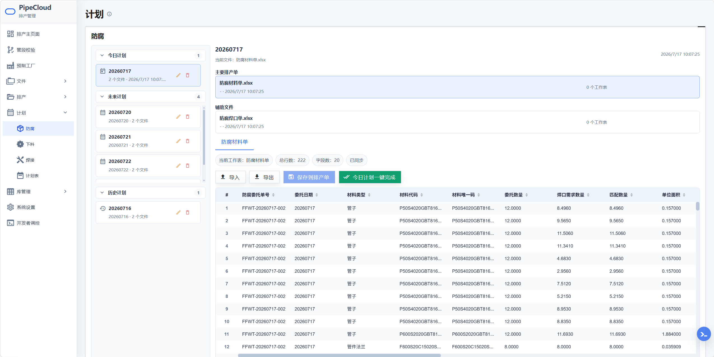
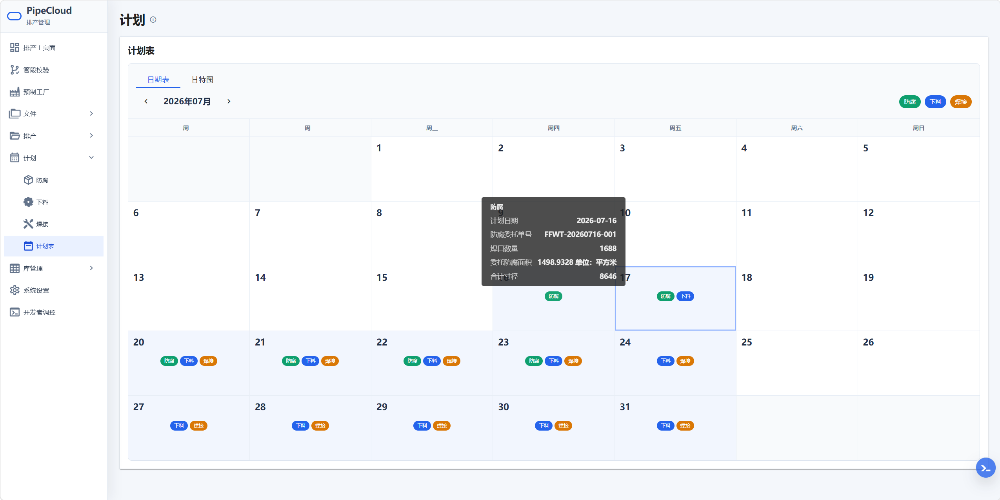

- 分类查看：区分今日、未来和历史计划，按日期加载计划文件与工作表明细。
- 当日维护：对允许维护的主计划文件，可编辑完成情况、导入修改补丁、一键标记完成、导出补丁，并在确认后保存。
- 历史与未来保护：以查看为主，减少误改已归档或尚未执行的数据。
- 日历与甘特：整体查看计划分布，点击日期进入明细，也可拖动计划调整日期。
- 数据同步：日期移动会更新计划记录及其关联数据源，保持总览与文件明细一致。

### 6. 库管理

库管理以大数据表格集中查看和维护项目关键业务库，当前主要包括：

- 预制焊口库。
- 管子材料库。
- 管件法兰材料库。
- 防腐管子材料库。
- 防腐管件法兰材料库。
- 总排产计划库。

页面支持工作表切换、列显示控制、筛选排序、选中计数、批量修改、批量删除、撤销和保存。管子类材料库可展示已确认使用管子、切割长度和剩余长度，辅助材料消耗追踪。所有操作结果统一进入全局消息中心。
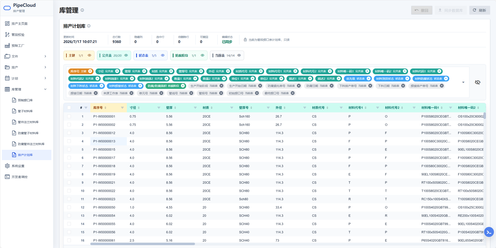

### 7. 预制工厂三维展示
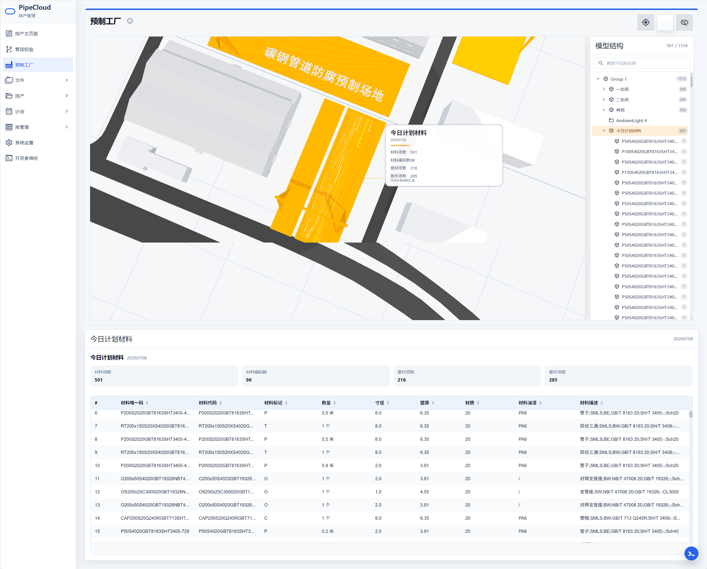

- 加载预制工厂 FBX 模型，并提供结构树、搜索、选中定位、隔离显示、视角重置和信息卡。
- 读取当前项目当日焊接计划与材料需求，在场景和信息面板中呈现计划摘要。
- 用于直观查看车间布局、当日管材分布和计划执行信息。

### 8. 系统设置与开发者控制
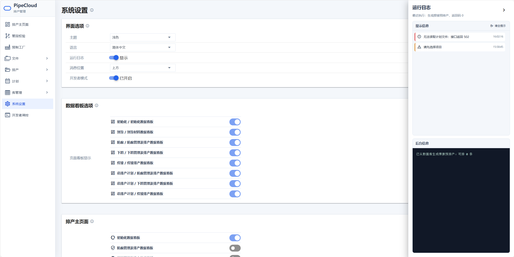
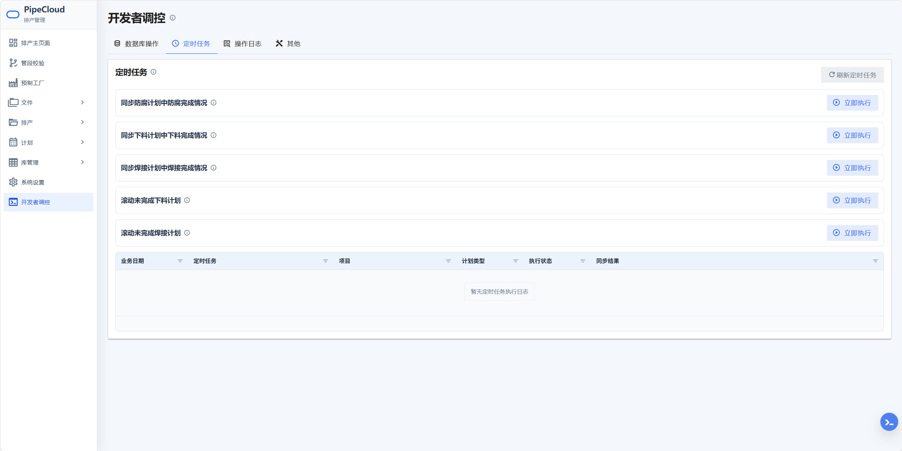

- 界面配置：主题、语言、侧栏状态、全局消息位置、运行日志显示。
- 可见性配置：导航项、首页组件、仪表盘和部分模块入口。
- 开发者模式：受开关控制，提供数据库概览与清理、定时任务手动执行、操作日志和运行输出等维护能力。
- 统一消息中心：成功、警告和错误消息集中展示，并保留当前浏览会话内的消息历史。

## 推荐排产流程

1. **选择或创建项目**：在项目首页确定当前项目，后续文件、库和计划操作均以该项目标识为边界。
2. **导入初始化数据**：在文件解析页解析 IDF/PCF，或上传已有初始化 Excel；预览无误后确认导入。
3. **生成预制焊口库**：进入初始化预制，筛选可预制焊口、划分自动焊并生成项目预制焊口库。
4. **导入入库单**：在到货管理中上传一个或多个入库单，预览后确认入库，并生成/更新材料库。
5. **同步到货状态**：把材料到货情况更新到预制焊口库。
6. **材料匹配与锁定**：设置匹配范围与集中度，检查切割分配和材料利用率，确认材料占用；需要调整时释放后重排。
7. **生成防腐预排产**：配置自动焊与集中度参数，检查可排/不可排结果。
8. **生成并确认防腐委托**：配置面积和日期规则，预览暂存委托后保存。
9. **生成下料预排产**：综合材料、到货和防腐状态执行匹配，核查切割可视化及不可排原因。
10. **生成并确认下料计划**：配置目标寸径、每日单数和日期规则，预览后保存计划及材料占用结果。
11. **生成焊接预排产与排产单**：设置日期、目标寸径和每日单数，预览焊接排产单、管段焊口表及领料数据后保存。
12. **生成总排产计划**：配置未来滚动参数，一次生成多类计划，检查暂存文件后统一保存。
13. **日常查看与维护**：在计划页查看防腐/下料/焊接计划和甘特分布，维护完成情况、补丁和日期。
14. **自动滚动维护**：后端定时任务默认从每天 21:00（Asia/Shanghai）起依次同步防腐、下料、焊接完成情况，并滚动未完成的下料与焊接计划；开发者控制页可手动执行相关任务。

## 项目目录

```text
Vue3 Pipecloud/
├─ frontend/                  Vue 3 单页应用
│  ├─ public/                图标和预制工厂三维模型
│  ├─ src/
│  │  ├─ api/                Django API 请求封装
│  │  ├─ components/         通用表格、看板、对话框和消息中心
│  │  ├─ composables/        可复用组合式交互逻辑
│  │  ├─ config/             浏览器运行时配置
│  │  ├─ plugins/            Vuetify 等应用级插件
│  │  ├─ router/             路由、懒加载和项目访问守卫
│  │  ├─ services/           全局状态、消息和业务辅助服务
│  │  └─ views/              按业务页面拆分的视图
│  └─ README.md              前端详细架构与目录说明
├─ backend/                   Django 服务与排产业务脚本
│  ├─ backend/               Django 配置、环境变量和定时任务
│  ├─ pipecloud/             API、模型、领域服务、管理命令和测试
│  ├─ prefab_schedule/       初始化、到货、防腐、下料、焊接算法
│  ├─ spool_analysis/        IDF/PCF 和管段结构解析工具
│  ├─ file/                  受控运行时文件、解析产物和备份
│  └─ README.md              后端详细架构与目录说明
├─ .gitignore
└─ README.md
```

## 快速启动

后端：

```bash
cd backend
python -m venv .venv
# Windows: .venv\Scripts\activate
pip install -r requirements.txt
copy .env.example .env
python manage.py migrate
python manage.py runserver
```

开发环境下，`runserver` 会同时启动定时任务进程；停止后端或发生自动重载时会同步关闭。主页数据看板默认使用 60 秒服务端缓存，并在项目数据修改成功后失效。

前端：

```bash
cd frontend
npm install
copy .env.example .env
npm run dev
```

浏览器默认访问 `http://localhost:5173`，Vite 将 `/api` 请求代理到 `http://127.0.0.1:8000`。完整环境变量、定时任务和目录职责见 [后端说明](backend/README.md) 与 [前端说明](frontend/README.md)。
